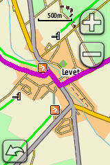
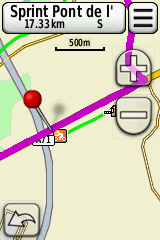
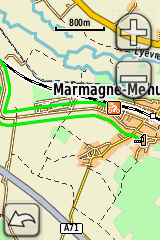
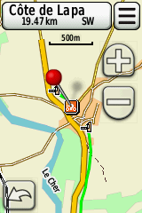
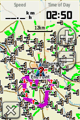
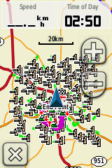
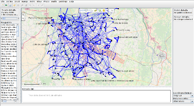
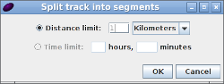
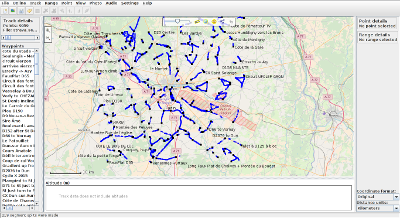

# strava_segments2gpx

Batch-export all Strava segments around a Point of Interest (POI) into GPX format for hand-held GPS.

Tired of not knowing where Strava segments are when you ride?
With this program, you need to supply the coordinates of the POI, for instance your city.
The executable then retrieves all the popular segments around this POI
and combines them into a GPX file that can be copied into
older GPS navigators with no connectivity.

You'll need to create a Strava app to get an
[access token](https://www.strava.com/settings/api).

[](https://travis-ci.org/arnaud-ramey/strava_segments2gpx)

Less words, more screenshots
============================

Screenshots on a [2012 Garmin Dakota 10](https://buy.garmin.com/en-GB/GB/p/30925):









  - In purple, the active track.
  - In green, the generated GPX containing all Strava segments.
  - Each Strava segment starts with an orange bike icon,
    and finishes with the toll icon.
  - Each segment is offset to the right side of the road so
    that it does not overlap with the active track.

Dependencies
============

You need the following libraries before compiling :

  * [cmake](https://cmake.org/)
  * [curl](https://curl.haxx.se/libcurl/)
  * [go](https://golang.org/)
  * [strava-segment-to-gpx](https://github.com/rgarcia/strava-segment-to-gpx)

<strike>One</strike> Two-liner for Ubuntu:

```bash
$ sudo apt install cmake  libcurl4-openssl-dev  golang-go
$ go get github.com/rgarcia/strava-segment-to-gpx
```

How to build the program
========================

The project is based on a ```CMakeLists```.
It is easy to build the program on a Unix computer.
Go in the source folder and type:
```bash
$ mkdir build
$ cd build
$ cmake ..
$ make
```

For Windows users, some instructions are available on OpenCV website:
http://opencv.willowgarage.com/wiki/Getting_started .

How to use the program
======================

To display the help,
from the main folder, run the generated executable
' ```build/test_strava_segments2gpx``` '
with no arguments.
It will display the help of the program.
Synopsis:

```
$ strava_segments2gpx TOKEN LAT LON RADIUS [NLAT]
Synopsis: ./strava_segments2gpx TOKEN LAT LON RADIUS
  TOKEN:  Strava developer token
  LAT:    latitude in decimal degrees of the center of the search area (for instance your city)
  LON:    longitude in decimal degrees of the center of the search area
  RADIUS: radius in kilometers of the search area
  NLAT:   number of cells in latitude or longitude (so nb of steps=NLAT*NLAT). Default: 3
  GPXDIR: folder where to store the retrieved segments GPX. Default: '/tmp'
  OUTFILE:filename of the generated GPX file. Default: 'strava_segments2gpx.gpx'

Example: ./strava_segments2gpx mytoken123  47.0810  2.3988  75
```

Showing the generated GPX with GpsPrune
=======================================





[GpsPrune](https://activityworkshop.net/software/gpsprune/)
is a handy open-source tool for inspecting GPX files.
However, it does not handle well the `<trkseg>` tag:
it draws a line between each pair of consecutive track segments,
and all segments appear as linked on the map: a nice spider web.

To split them in independant segments, use ```Track > Split track into segments```.
A threshold value of 1 km should do the trick.

Licence
=======

LGPL v3, check file ```LICENCE```.

Authors
=======

Arnaud Ramey <arnaud.a.ramey@gmail.com>
  -- Robotics Lab, University Carlos III of Madrid
